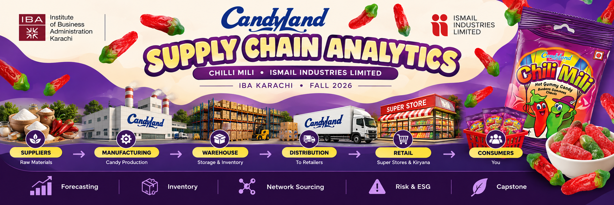
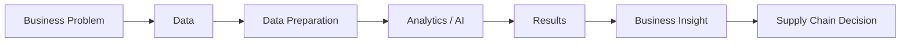

<div align="center">



<br>

### Supply Chain Analytics × Artificial Intelligence

**CandyLand Chilli Milli · Ismail Industries Limited · IBA Karachi · Fall 2026**

<br>


<br>

> A semester-long exploration of **Supply Chain Analytics and Artificial Intelligence**,  
> applying data-driven methods to the supply chain of **CandyLand Chilli Milli**.

</div>

---

## 📌 About This Repository

This repository documents the analytical work completed for the **Supply Chain Analytics** course at the **Institute of Business Administration (IBA), Karachi**, taught by **Sir Faisal Jalal**.

The semester project focuses on the supply chain of **Chilli Milli**, a CandyLand product by **Ismail Industries Limited**.

The repository combines traditional supply chain concepts with **data analytics and Artificial Intelligence (AI)** to explore how better decisions can be made across the supply chain — from understanding demand to managing inventory, sourcing, risk, sustainability, and the final integrated supply chain strategy.

The project follows a simple philosophy:

<div align="center">

### Data → Analytics → AI → Better Supply Chain Decisions

</div>

---

## 🍬 Supply Chain Focus

The project follows Chilli Milli through its supply chain from raw materials to the final consumer.

<div align="center">

### 🌾 Suppliers → 🏭 Manufacturing → 📦 Warehouse → 🚚 Distribution → 🏪 Retail → 👥 Consumer

**Raw Materials** → **Candy Production** → **Storage & Inventory** → **Distribution Network** → **Super Stores & Kiryana** → **Customer**

</div>

Each stage creates different analytical questions — from estimating future demand to determining inventory requirements, evaluating sourcing decisions, identifying risks, and improving overall supply chain performance.

---

## 🧭 Repository Navigation

| Module | Focus | What It Covers |
|:---|:---|:---|
| 📂 `00 Initial Working` | Foundation | Initial coursework, company research and exploratory analysis |
| 📈 `01 Forecasting` | Demand Planning | Demand forecasting, forecast accuracy and uncertainty |
| 📦 `02 Inventory` | Inventory Analytics | Inventory decisions, policies and performance analysis |
| 🌐 `03 Network Sourcing` | Supply Network | Suppliers, sourcing and supply network analysis |
| 🌱 `04 Risk ESG` | Risk & Sustainability | Supply chain risk, resilience, ESG and sustainability |
| 🎓 `05 Capstone` | Final Project | Integrated supply chain analysis and recommendations |
| 📝 `Assignments` | Coursework | Individual course assignments and exercises |
| 🗃️ `Data` | Data | Raw, processed and supporting datasets |

---

## 📊 Analytics Journey

The repository develops progressively throughout the semester.

```text
                         DATA
                          │
                          ▼
                 ┌─────────────────┐
                 │   FORECASTING   │
                 └────────┬────────┘
                          │
                          ▼
                 ┌─────────────────┐
                 │    INVENTORY    │
                 └────────┬────────┘
                          │
                          ▼
                 ┌─────────────────┐
                 │ NETWORK &       │
                 │ SOURCING        │
                 └────────┬────────┘
                          │
                          ▼
                 ┌─────────────────┐
                 │   RISK & ESG    │
                 └────────┬────────┘
                          │
                          ▼
                 ┌─────────────────┐
                 │    CAPSTONE     │
                 └─────────────────┘

        ─────────────────────────────────────
             AI + ANALYTICS SUPPORT
                ACROSS ALL STAGES
        ─────────────────────────────────────
```

Rather than treating AI as a separate supply chain stage, the project explores how **AI can support decisions throughout the entire analytical process**.

---

## 🤖 AI in Supply Chain Analytics

Artificial Intelligence is incorporated where it can improve **prediction, analysis, automation, or managerial decision-making**.

Potential applications throughout the semester include:

- 📈 **AI-assisted demand forecasting**
- 📦 **Inventory planning and optimization**
- 🌐 **Supplier and sourcing analysis**
- ⚠️ **Supply chain risk identification**
- 🌱 **ESG and sustainability analysis**
- 🔍 **Pattern and anomaly detection**
- 💡 **AI-assisted decision support**
- 📊 **Automated analytical insights and reporting**

The objective is not simply to use AI, but to evaluate **where AI adds meaningful value compared with traditional analytical methods**.

---

## 🏢 Case Company & Product

| Category | Details |
|:---|:---|
| 🏢 **Company** | Ismail Industries Limited |
| 🍭 **Brand** | CandyLand |
| 🍬 **Product** | Chilli Milli |
| 🏭 **Industry** | Confectionery / FMCG |
| 📚 **Course** | Supply Chain Analytics |
| 🎓 **Institution** | Institute of Business Administration (IBA), Karachi |
| 👨‍🏫 **Instructor** | Sir Faisal Jalal |
| 📅 **Semester** | Fall 2026 |

Chilli Milli serves as the focal product for connecting classroom concepts with the supply chain of a real Pakistani consumer-goods company.

---

## 🔍 Key Analytical Areas

Throughout the semester, the project explores five major areas of supply chain analytics.

### 📈 01 — Forecasting

Understanding future demand and the uncertainty surrounding it.

**Focus areas:**

`Demand Forecasting` · `Forecast Error` · `MAE / MAD` · `MAPE` · `Demand Variability` · `Scenario Analysis`

---

### 📦 02 — Inventory Analytics

Translating demand information into better inventory decisions.

**Focus areas:**

`Inventory Planning` · `Stock Levels` · `Safety Stock` · `Service Levels` · `Inventory Performance` · `Decision Analysis`

---

### 🌐 03 — Network & Sourcing

Understanding how materials and products move through the supply network.

**Focus areas:**

`Suppliers` · `Procurement` · `Sourcing` · `Distribution` · `Network Design` · `Supplier Evaluation`

---

### 🌱 04 — Risk & ESG

Evaluating supply chain vulnerabilities and sustainability considerations.

**Focus areas:**

`Supply Chain Risk` · `Resilience` · `ESG` · `Sustainability` · `Risk Assessment` · `Mitigation`

---

### 🎓 05 — Capstone

Bringing the semester's analytical work together into an integrated supply chain analysis.

```text
Forecasting
     +
Inventory
     +
Network & Sourcing
     +
Risk & ESG
     +
Artificial Intelligence
     ↓
Integrated Supply Chain Strategy
```

---

## 🛠️ Tools & Technologies

The repository uses a combination of analytical, programming and business tools depending on the requirements of each module.

### Analytics & Programming

`Python` · `Pandas` · `NumPy` · `Data Visualization` · `Statistical Analysis`

### Business Analysis

`Microsoft Excel` · `Forecasting Models` · `Inventory Analysis` · `Supply Chain KPIs`

### Artificial Intelligence

`AI-assisted Analysis` · `Machine Learning` · `Pattern Detection` · `Decision Support` · `Automated Insights`

### Development & Documentation

`Git` · `GitHub` · `Jupyter / Google Colab` · `Markdown`

---

## 📁 Repository Structure

```text
supply_chain_analytics_IBA/
│
├── 00 Initial Working/
│   └── Initial exploration and course work
│
├── 01 Forecasting/
│   └── Demand forecasting and forecast evaluation
│
├── 02 Inventory/
│   └── Inventory analytics and decision models
│
├── 03 Network Sourcing/
│   └── Supply network and sourcing analysis
│
├── 04 Risk ESG/
│   └── Risk, resilience and ESG analysis
│
├── 05 Capstone/
│   └── Final integrated project
│
├── Assignments/
│   └── Course assignments and exercises
│
├── Data/
│   └── Raw and processed datasets
│
├── assets/
│   └── supply_chain_analytics_banner.png
│
└── README.md
```

---

## 🎯 Project Objectives

The purpose of this repository goes beyond performing calculations. The goal is to translate **data into actionable supply chain decisions**.

Throughout the semester, the project aims to answer questions such as:

1. **How accurately can future demand for Chilli Milli be forecast?**
2. **How should inventory decisions respond to demand uncertainty?**
3. **How does the product move through suppliers, manufacturing, distribution and retail?**
4. **How should sourcing and supply network decisions be evaluated?**
5. **Where are the major risks and vulnerabilities in the supply chain?**
6. **How can ESG and sustainability considerations influence supply chain decisions?**
7. **Where can AI improve prediction, analysis or decision-making?**
8. **How can all of these insights be combined into an integrated supply chain strategy?**

---

## 🧠 Analytical Approach

Each major analysis in this repository follows a general decision-oriented workflow:



The emphasis is therefore not only on producing models or calculations, but also on explaining **what the results mean for the supply chain**.

---

## 📈 Project Development

This repository will continue to evolve throughout **Fall 2026** as new topics are covered in the course.

New analyses, datasets, models and AI applications will be added to their corresponding modules as the semester progresses.

> **Status:** 🟡 Ongoing — Fall 2026

---

## 📚 Academic Context

This repository has been developed as part of academic coursework for:

**Supply Chain Analytics**  
**Institute of Business Administration (IBA), Karachi**  
**Fall 2026**

The analyses contained in this repository are developed for educational purposes and should be interpreted within the context of the course project.

---

<div align="center">

### 🍬 Chilli Milli Supply Chain Analytics

**Forecasting · Inventory · Network Sourcing · Risk & ESG · Artificial Intelligence**

<br>

### Data → Analytics → AI → Decisions

<sub>Supply Chain Analytics · IBA Karachi · Fall 2026</sub>

</div>
