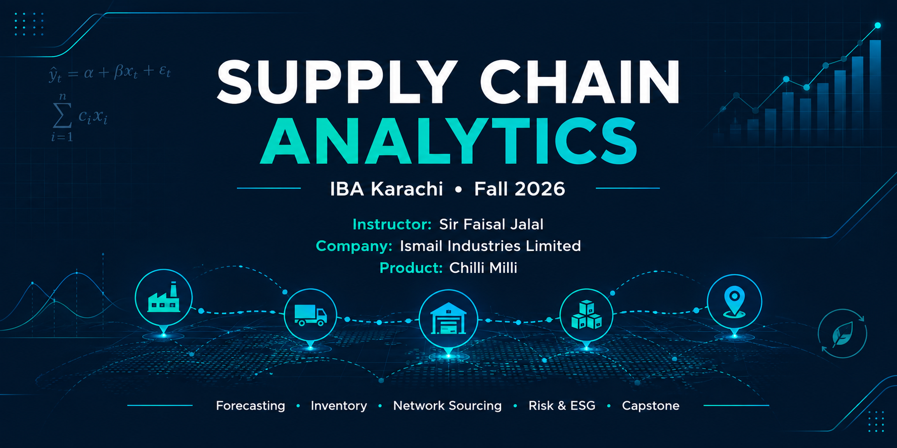

 

| 🎓 Institution | 👨‍🏫 Instructor | 🏢 Company | 🍬 Product |
|:---:|:---:|:---:|:---:|
| IBA Karachi | Sir Faisal Jalal | Ismail Industries Limited | Chilli Milli |

 

> A structured collection of analytical work for **Supply Chain Analytics at IBA Karachi**, developed around the supply chain of **Chilli Milli by Ismail Industries Limited**.

 

## 🧭 Repository Navigation

| Section | Focus |
|:---|:---|
| `00 Initial Working` | Initial course work and exploratory analysis |
| `01 Forecasting` | Forecasting methods and applications |
| `02 Inventory` | Inventory analysis and decision making |
| `03 Network Sourcing` | Sourcing and supply network analysis |
| `04 Risk ESG` | Supply chain risk and ESG analysis |
| `05 Capstone` | Final project and applied analysis |
| `Assignments` | Course assignments |
| `Data` | Datasets and supporting data |
